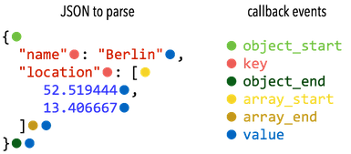

# <small>nlohmann::basic_json::</small>parser_callback_t

```cpp
template<typename BasicJsonType>
using parser_callback_t =
    std::function<bool(int depth, parse_event_t event, BasicJsonType& parsed)>;
```

With a parser callback function, the result of parsing a JSON text can be influenced. When passed to
[`parse`](parse.md), it is called on certain events (passed as [`parse_event_t`](parse_event_t.md) via parameter
`event`) with a set recursion depth `depth` and context JSON value `parsed`. The return value of the callback function
is a boolean indicating whether the element that emitted the callback shall be kept or not.

We distinguish six scenarios (determined by the event type) in which the callback function can be called. The following
table describes the values of the parameters `depth`, `event`, and `parsed`.

| parameter `event`             | description                                               | parameter `depth`                         | parameter `parsed`               |
|-------------------------------|-----------------------------------------------------------|-------------------------------------------|----------------------------------|
| `parse_event_t::object_start` | the parser read `{` and started to process a JSON object  | depth of the parent of the JSON object    | a JSON value with type discarded |
| `parse_event_t::key`          | the parser read a key of a value in an object             | depth of the currently parsed JSON object | a JSON string containing the key |
| `parse_event_t::object_end`   | the parser read `}` and finished processing a JSON object | depth of the parent of the JSON object    | the parsed JSON object           |
| `parse_event_t::array_start`  | the parser read `[` and started to process a JSON array   | depth of the parent of the JSON array     | a JSON value with type discarded |
| `parse_event_t::array_end`    | the parser read `]` and finished processing a JSON array  | depth of the parent of the JSON array     | the parsed JSON array            |
| `parse_event_t::value`        | the parser finished reading a JSON value                  | depth of the value                        | the parsed JSON value            |



Discarding a value (i.e., returning `#!cpp false`) has different effects depending on the context in which function was
called:

- Discarded values in structured types are skipped. That is, the parser will behave as if the discarded value was never
  read.
- In case a value outside a structured type is skipped, it is replaced with `null`. This case happens if the top-level
  element is skipped.

## Parameters

`depth` (in)
:   the depth of the recursion during parsing

`event` (in)
:   an event of type [`parse_event_t`](parse_event_t.md) indicating the context in
    the callback function has been called

`parsed` (in, uv)
:    the current intermediate parse result; note that
     writing to this value has no effect for `parse_event_t::key` events

## Return value

Whether the JSON value which called the function during parsing should be kept (`#!cpp true`) or not (`#!cpp false`). In
the latter case, it is either skipped completely or replaced by an empty discarded object.

## Examples

??? example

    The example below demonstrates the `parse()` function with
    and without callback function.

    ```cpp
    --8<-- "examples/parse__string__parser_callback_t.cpp"
    ```
    
    Output:
    
    ```json
    --8<-- "examples/parse__string__parser_callback_t.output"
    ```

## Version history

- Added in version 1.0.0.
